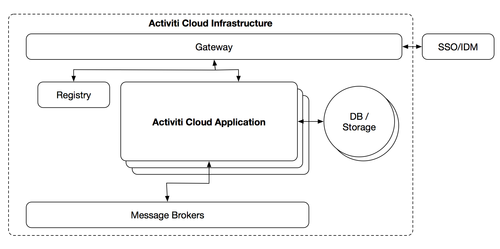

### activiti cloud overview   https://activiti.gitbook.io/activiti-7-developers-guide/components-architecture/overview
activiti cloud 提供了支持整个平台的基本服务和仅限于BPM的服务，所有的服务之间可以进行解耦，你可以自由的重新整合或替代服务。  
下列是已开发的服务：  
- Activiti Cloud Infrastructure  
-- Activiti Cloud Gateway   
-- Activiti Cloud Registry   
-- Activiti Cloud Single Sign On (SSO)  
-- Activiti Cloud Identity Management (IDM)  
-- Activiti Cloud Configuration Server  
-- Activiti Cloud Logging   
-- Storage / Databases   
-- Message Brokers    
- Activiti Cloud Applications  
-- Activiti Cloud Query Service   
-- Activiti Cloud Audit Service   
-- Activiti Cloud Notification Service  
-- Activiti Cloud Runtime Bundles  
-- Activiti Cloud Connectors  
定义了需要由基础框架提供的服务，这意味着在不同的环境中这些组件可以被其他的基础服务所替代。其他的组件需要依赖于这些服务来正常工作  
 

