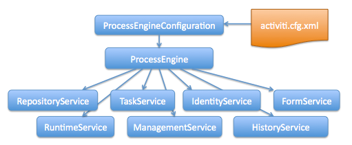

## activiti  https://www.activiti.org/
### 快速开始  https://www.activiti.org/quick-start
$mvnProject 项目根目录  
- 创建和启动一个Maven项目：$mvnProject/pom.xml   
```
<project xmlns="http://maven.apache.org/POM/4.0.0" xmlns:xsi="http://www.w3.org/2001/XMLSchema-instance" xsi:schemaLocation="http://maven.apache.org/POM/4.0.0 http://maven.apache.org/xsd/maven-4.0.0.xsd">
  <modelVersion>4.0.0</modelVersion>
  <groupId>$quickStartJavaProjectName</groupId>
  <artifactId>$quickStartJavaProjectName</artifactId>
  <version>0.0.1-SNAPSHOT</version>

  <!-- ... other configurations may exist, such as a build stanza, depending your environment ... -->

  <dependencies>
    <dependency>
      <groupId>org.activiti</groupId>
      <artifactId>activiti-engine</artifactId>
      <version>$actVer</version>
    </dependency>
    <dependency>
      <groupId>org.slf4j</groupId>
      <artifactId>slf4j-api</artifactId>
      <version>1.7.21</version>
    </dependency>
    <dependency>
      <groupId>org.slf4j</groupId>
      <artifactId>slf4j-log4j12</artifactId>
      <version>1.7.21</version>
    </dependency>
    <dependency>
      <groupId>/groupId>
      <artifactId>h2</artifactId>
      <version>1.4.193</version>
    </dependency>
  </dependencies>
</project>
```
$actVer替换为官方版本 当前示例的版本号为6.0.0  数据库换成mysql  
```
    <dependency>
      <groupId>mysql</groupId>
      <artifactId>mysql-connector-java</artifactId>
      <version>6.0.6</version>
    </dependency>
 ```  
 
- 创建流程引擎  
添加log4j依赖 $mvnProject/src/main/resources/log4j.properties  
```
log4j.rootLogger=DEBUG, ACT

log4j.appender.ACT=org.apache.log4j.ConsoleAppender
log4j.appender.ACT.layout=org.apache.log4j.PatternLayout
log4j.appender.ACT.layout.ConversionPattern= %d{hh:mm:ss,SSS} [%t] %-5p %c %x - %m%n  
```  
创建main方法  $mvnProject/src/main/java/com/example/OnboardingRequest.java  
```  
package com.example;

import org.activiti.engine.ProcessEngine;
import org.activiti.engine.ProcessEngineConfiguration;
import org.activiti.engine.impl.cfg.StandaloneProcessEngineConfiguration;

public class OnboardingRequest {
  public static void main(String[] args) {
    ProcessEngineConfiguration cfg = new StandaloneProcessEngineConfiguration()
      .setJdbcUrl("jdbc:mysql://localhost:3306/activiti?useUnicode=true&useJDBCCompliantTimezoneShift=true&useLegacyDatetimeCode=false&serverTimezone=UTC")
      .setJdbcUsername("sa")
      .setJdbcPassword("")
      .setJdbcDriver("com.mysql.cj.jdbc.Driver")
      .setDatabaseSchemaUpdate(ProcessEngineConfiguration.DB_SCHEMA_UPDATE_TRUE);
    ProcessEngine processEngine = cfg.buildProcessEngine();
    String pName = processEngine.getName();
    String ver = ProcessEngine.VERSION;
    System.out.println("ProcessEngine [" + pName + "] Version: [" + ver + "]");
  }
}
```  
- 发布一个流程定义  
我们准备在Activiti引擎中发布一个BPM流程逻辑.当前示例里输入数据,如果数据大于3,会执行用户自定义的流程在后台进行数据的交互.如果数据小于或者等于3会在后台输出简单的信息。Activiti服从BPMN2.0规范。示例文件可以可视化展示为下图，具体xml文件在$mvnProject/src/main/resources/.  

- 在$mvnProject/src/main/java/com/example/OnboardingRequest.java   
```
    RepositoryService repositoryService = processEngine.getRepositoryService();
    //加载bpmn文件并发布到Activiti流程引擎中
    Deployment deployment = repositoryService.createDeployment()
        .addClasspathResource("onboarding.bpmn20.xml").deploy();
    //打印流程信息可以看到确实加载到引擎中
    ProcessDefinition processDefinition = repositoryService.createProcessDefinitionQuery()
        .deploymentId(deployment.getId()).singleResult();
    System.out.println(
        "Found process definition [" 
            + processDefinition.getName() + "] with id [" 
            + processDefinition.getId() + "]");
``` 
- 执行流程示例  修改Log4j日志等级为log4j.rootLogger=WARN, ACT  

```
   //开启onboarding流程
   RuntimeService runtimeService = processEngine.getRuntimeService();
   ProcessInstance processInstance = runtimeService
   .startProcessInstanceByKey("onboarding");
   System.out.println("Onboarding process started with process instance id ["
       + processInstance.getProcessInstanceId()
       + "] key [" + processInstance.getProcessDefinitionKey() + "]");
    //导入Activiti的主要API 
    TaskService taskService = processEngine.getTaskService();
    FormService formService = processEngine.getFormService();
    HistoryService historyService = processEngine.getHistoryService();

    Scanner scanner = new Scanner(System.in);
    while (processInstance != null && !processInstance.isEnded()) {
      //从命名行获取符合管理员角色输入的参数值
      List<Task> tasks = taskService.createTaskQuery()
          .taskCandidateGroup("managers").list();
      System.out.println("Active outstanding tasks: [" + tasks.size() + "]");
      for (int i = 0; i < tasks.size(); i++) {
        Task task = tasks.get(i);
        System.out.println("Processing Task [" + task.getName() + "]");
        Map<String, Object> variables = new HashMap<String, Object>();
        FormData formData = formService.getTaskFormData(task.getId());
        for (FormProperty formProperty : formData.getFormProperties()) {
          //输入不同类型的参数值
          if (StringFormType.class.isInstance(formProperty.getType())) {
            System.out.println(formProperty.getName() + "?");
            String value = scanner.nextLine();
            variables.put(formProperty.getId(), value);
          } else if (LongFormType.class.isInstance(formProperty.getType())) {
            System.out.println(formProperty.getName() + "? (Must be a whole number)");
            Long value = Long.valueOf(scanner.nextLine());
            variables.put(formProperty.getId(), value);
          } else if (DateFormType.class.isInstance(formProperty.getType())) {
            System.out.println(formProperty.getName() + "? (Must be a date m/d/yy)");
            DateFormat dateFormat = new SimpleDateFormat("m/d/yy");
            Date value = dateFormat.parse(scanner.nextLine());
            variables.put(formProperty.getId(), value);
          } else {
            System.out.println("<form type not supported>");
          }
        }
        taskService.complete(task.getId(), variables);
        //打印历史记录信息
        HistoricActivityInstance endActivity = null;
        List<HistoricActivityInstance> activities = 
            historyService.createHistoricActivityInstanceQuery()
            .processInstanceId(processInstance.getId()).finished()
            .orderByHistoricActivityInstanceEndTime().asc()
            .list();
        for (HistoricActivityInstance activity : activities) {
          if (activity.getActivityType().equals("startEvent")) {
            System.out.println("BEGIN " + processDefinition.getName() 
                + " [" + processInstance.getProcessDefinitionKey()
                + "] " + activity.getStartTime());
          }
          if (activity.getActivityType().equals("endEvent")) {
            // Handle edge case where end step happens so fast that the end step
            // and previous step(s) are sorted the same. So, cache the end step 
            //and display it last to represent the logical sequence.
            endActivity = activity;
          } else {
            System.out.println("-- " + activity.getActivityName() 
                + " [" + activity.getActivityId() + "] "
                + activity.getDurationInMillis() + " ms");
          }
        }
        if (endActivity != null) {
          System.out.println("-- " + endActivity.getActivityName() 
                + " [" + endActivity.getActivityId() + "] "
                + endActivity.getDurationInMillis() + " ms");
          System.out.println("COMPLETE " + processDefinition.getName() + " ["
                + processInstance.getProcessDefinitionKey() + "] " 
                + endActivity.getEndTime());
        }
      }
      // Re-query the process instance, making sure the latest state is available
      processInstance = runtimeService.createProcessInstanceQuery()
          .processInstanceId(processInstance.getId()).singleResult();
    }
    scanner.close();
```  
- 在java中编写服务任务   
可以在xml里写javascript脚本来处理服务,  也可以通过java类来处理  /src/main/java/com/example/AutomatedDataDelegate.java 
```
//设置变量autoWelcomeTime为当前时间
 Date now = new Date();
 execution.setVariable("autoWelcomeTime", now);
 System.out.println("Faux call to backend for [" 
 + execution.getVariable("fullName") + "]");  
```
    
```
<?xml version="1.0" encoding="UTF-8"?>
<definitions xmlns="http://www.omg.org/spec/BPMN/20100524/MODEL" xmlns:xsi="http://www.w3.org/2001/XMLSchema-instance" xmlns:xsd="http://www.w3.org/2001/XMLSchema" xmlns:activiti="http://activiti.org/bpmn" xmlns:bpmndi="http://www.omg.org/spec/BPMN/20100524/DI" xmlns:omgdc="http://www.omg.org/spec/DD/20100524/DC" xmlns:omgdi="http://www.omg.org/spec/DD/20100524/DI" typeLanguage="http://www.w3.org/2001/XMLSchema" expressionLanguage="http://www.w3.org/1999/XPath" targetNamespace="http://www.activiti.org/processdef">
  <process id="onboarding" name="Onboarding" isExecutable="true">
...
    <scriptTask id="automatedIntro" name="Generic and Automated Data Entry" scriptFormat="javascript" activiti:autoStoreVariables="false">
      <script><![CDATA[var dateAsString = new Date().toString();
execution.setVariable("autoWelcomeTime", dateAsString);]]></script>
    </scriptTask>
...
```  

``` 
<?xml version="1.0" encoding="UTF-8"?>
<definitions xmlns="http://www.omg.org/spec/BPMN/20100524/MODEL" xmlns:xsi="http://www.w3.org/2001/XMLSchema-instance" xmlns:xsd="http://www.w3.org/2001/XMLSchema" xmlns:activiti="http://activiti.org/bpmn" xmlns:bpmndi="http://www.omg.org/spec/BPMN/20100524/DI" xmlns:omgdc="http://www.omg.org/spec/DD/20100524/DC" xmlns:omgdi="http://www.omg.org/spec/DD/20100524/DI" typeLanguage="http://www.w3.org/2001/XMLSchema" expressionLanguage="http://www.w3.org/1999/XPath" targetNamespace="http://www.activiti.org/processdef">
  <process id="onboarding" name="Onboarding" isExecutable="true">
...
   <serviceTask id="automatedIntro" name="Generic and Automated Data Entry" activiti:class="com.example.AutomatedDataDelegate"></serviceTask>
```

### 补充说明
数据库，可以直接在代码中写配置，也可以在classpath下添加activiti.cfg.xml进行配置
> 数据库名称解释
> - ACT_RE_*:RE代表 repository，所有以该前缀开头的表包含着静态信息，比如流程的定义和流程资源（图片，规则等）
> - ACT_RU_*:RU代表 runtime,这些表里包含着运行时的流程实例,用户任务，变量和工作等。activiti在流程执行时保存这些数据，当流程结束时会删除这些记录。
> - ACT_ID_*:ID代表 identity，这些表包含着身份信息，比如用户，组等
> - ACT_HI_*:HI代表 history，这些表里包含着历史数据，比如执行过的流程实例,变量,任务等
> - ACT_GE_*:general数据，用在多个场合在中。

http://www.cnblogs.com/llzgzljl/archive/2013/10/07/3356108.html

### API
- Process Engine API and services
  

```
ProcessEngine processEngine = ProcessEngines.getDefaultProcessEngine();
RuntimeService runtimeService = processEngine.getRuntimeService();
RepositoryService repositoryService = processEngine.getRepositoryService();
TaskService taskService = processEngine.getTaskService();
ManagementService managementService = processEngine.getManagementService();
IdentityService identityService = processEngine.getIdentityService();
HistoryService historyService = processEngine.getHistoryService();
FormService formService = processEngine.getFormService();
```
ProcessEngines.getDefaultProcessEngine() 在第一次被调用时将初始化并构建流程引擎，在之后的调用都会返回相同的流程引
擎。流程引擎的创建通过 ProcessEngines.init() 实现，关闭由 ProcessEngines.destroy() 实现。
ProcessEngines会扫描所有 activiti.cfg.xml 与 activiti‐context.xml 文件。对于所有的 activiti.cfg.xml 文件，流程引擎会
以标准Activiti方式构
建： ProcessEngineConfiguration.createProcessEngineConfigurationFromInputStream(inputStream).buildProcessEngine() 。
对于所有的 activiti‐context.xml 文件，流程引擎会以Spring的方式构建：首先构建Spring应用上下文，然后从该上下文中获取流程
引擎。
所有的服务都是无状态的。这意味着你可以很容易的在集群环境的多个节点上运行Activiti，使用同一个数据库，而不用担心上一次调用
实际在哪台机器上执行。不论在哪里执行，对任何服务的任何调用都是幂等（idempotent）的。

RepositoryService很可能是使用Activiti引擎要用的第一个服务。这个服务提供了管理与控制 deployments （部署）与 process
definitions （流程定义）的操作。在这里简单说明一下，流程定义是BPMN 2.0流程的Java等价副本，展现流程中每一步的结构与行
为。 deployment 是 Activiti引擎中的包装单元，一个部署中可以包含多个BPMN 2.0 xml文件，以及其他资源。开发者可以决定在一个部
署中包含的内容，可以是单各流程的BPMN 2.0 xml文件，也可以包含多个流程及其相关资源（如’hr­processes’部署可以包含所有与人
力资源流程相关的的东西）。 RepositoryService 可用于 deploy （部署）这样的包。部署意味着将它上传至引擎，引擎将在储存至数
据库之前检查与分析所有的流程。从这里开始，系统知道了这个部署，部署中包含的所有流程都可以启动。
此外，这个服务还可以：
查询引擎已知的部署与流程定义。
暂停或激活部署中的某些流程，或整个部署。暂停意味着不能再对它进行操作，激活是其反操作。
读取各种资源，比如部署中保存的文件，或者引擎自动生成的流程图。
读取POJO版本的流程定义。使用它可以用Java而不是xml的方式检查流程。

RepositoryService 提供的是静态信息（也就是不会改变，至少不会经常改变的信息），而RuntimeService就完全相反。它可以启动
流程定义的新流程实例。前面介绍过， process definition （流程定义）定义了流程中不同步骤的结构与行为。流程实例则是流程定
义的实际执行。同一时刻，一个流程定义通常有多个运行中的实例。 RuntimeService 也用于读取与存储 process variables （流程
变量）。流程变量是给定流程持有的数据，可以在流程的许多构造中使用（例如排他网关exclusive gateway 经常使用流程变量决定流程
下一步要选择的路径）。 RuntimeService 还可以用于查询流程实例与执行（execution）。执行代表了BPMN 2.0中的 'token' 概
念。通常执行是指向流程实例当前位置的指针。最后， RuntimeService 还可以在流程实例等待外部触发时使用，以便流程可以继续运
服务提供了许多操作用于“通知”流程实例，告知已经接收到外部触发，流程有许多 wait states （暂停状态）， RuntimeService 服务提供了许多操作用于“通知”流程实例，告知已经接收到外部触发，
使流程实例可以继续运行。

对于像Activiti这样的BPM引擎来说，核心是需要人类用户实际操作的任务。所有任务相关的东西都组织在TaskService中，例如
查询分派给用户或组的任务
创建standalone（独立运行）任务。这是一种没有关联到流程实例的任务。
决定任务的执行用户（assignee），或者将用户通过某种方式与任务关联。
认领（claim）与完成（complete）任务。认领是指某人决定成为任务的执行用户，也即他将会完成这个任务。完成任务是指“做这个
任务要求的工作”，通常是填写某种表单。


IdentityService很简单。它用于管理（创建，更新，删除，查询……）组与用户。请重点注 意，Activiti实际上在运行时并不做任何用户
检查。例如任务可以分派给任何用户，而引擎并不会验证系统中是否存在该用户。这是因为Activiti 有时要与LDAP、Active Directory等
服务结合使用。


FormService是可选服务。也就是说Activiti没有它也能很好地运行，而不必牺牲任何功能。这个服务引入了start form（开始表单）与
task form（任务表单）的概念。 开始表单是在流程实例启动前显示的表单，而任务表单是用户完成任务时显示的表单。Activiti可以在
BPMN 2.0流程定义中定义这些表单。表单服务通过简单的方式暴露这些数据。再次重申，表单不一定要嵌入流程定义，因此这个服务
是可选的。


HistoryService暴露所有Activiti引擎收集的历史数据。当执行流程时，引擎会保存许多数据（可以配置），例如流程实例启动时间，谁
在执行哪个任务，完成任务花费的事件，每个流程实例的执行路径，等等。这个服务主要提供查询这些数据的能力。


ManagementService通常在用Activiti编写用户应用时不需要使用。它可以用于读取数据库 表与表原始数据的信息，也提供了对作业
（job）的查询与管理操作。Activiti中很多地方都使用作业，例如定时器（timer），异步操作 （asynchronous continuation），延时暂
停/激活（delayed suspension/activation）等等。

### 其他资料
https://www.cnblogs.com/hellowood23/p/5437909.html
https://my.oschina.net/u/1762811/blog/2249536


