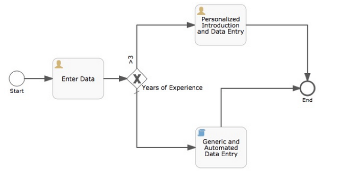

## activiti  https://www.activiti.org/
### 快速开始  https://www.activiti.org/quick-start
$mvnProject 项目根目录  
- 创建和启动一个Maven项目：$mvnProject/pom.xml   
```
<project xmlns="http://maven.apache.org/POM/4.0.0" xmlns:xsi="http://www.w3.org/2001/XMLSchema-instance" xsi:schemaLocation="http://maven.apache.org/POM/4.0.0 http://maven.apache.org/xsd/maven-4.0.0.xsd">
  <modelVersion>4.0.0</modelVersion>
  <groupId>$quickStartJavaProjectName</groupId>
  <artifactId>$quickStartJavaProjectName</artifactId>
  <version>0.0.1-SNAPSHOT</version>

  <!-- ... other configurations may exist, such as a build stanza, depending your environment ... -->

  <dependencies>
    <dependency>
      <groupId>org.activiti</groupId>
      <artifactId>activiti-engine</artifactId>
      <version>$actVer</version>
    </dependency>
    <dependency>
      <groupId>org.slf4j</groupId>
      <artifactId>slf4j-api</artifactId>
      <version>1.7.21</version>
    </dependency>
    <dependency>
      <groupId>org.slf4j</groupId>
      <artifactId>slf4j-log4j12</artifactId>
      <version>1.7.21</version>
    </dependency>
    <dependency>
      <groupId>/groupId>
      <artifactId>h2</artifactId>
      <version>1.4.193</version>
    </dependency>
  </dependencies>
</project>
```
$actVer替换为官方版本 当前示例的版本号为6.0.0  数据库换成mysql  
```
    <dependency>
      <groupId>mysql</groupId>
      <artifactId>mysql-connector-java</artifactId>
      <version>6.0.6</version>
    </dependency>
 ```  
 
- 创建流程引擎  
添加log4j依赖 $mvnProject/src/main/resources/log4j.properties  
```
log4j.rootLogger=DEBUG, ACT

log4j.appender.ACT=org.apache.log4j.ConsoleAppender
log4j.appender.ACT.layout=org.apache.log4j.PatternLayout
log4j.appender.ACT.layout.ConversionPattern= %d{hh:mm:ss,SSS} [%t] %-5p %c %x - %m%n  
```  
创建main方法  $mvnProject/src/main/java/com/example/OnboardingRequest.java  
```  
package com.example;

import org.activiti.engine.ProcessEngine;
import org.activiti.engine.ProcessEngineConfiguration;
import org.activiti.engine.impl.cfg.StandaloneProcessEngineConfiguration;

public class OnboardingRequest {
  public static void main(String[] args) {
    ProcessEngineConfiguration cfg = new StandaloneProcessEngineConfiguration()
      .setJdbcUrl("jdbc:mysql://localhost:3306/activiti?useUnicode=true&useJDBCCompliantTimezoneShift=true&useLegacyDatetimeCode=false&serverTimezone=UTC")
      .setJdbcUsername("sa")
      .setJdbcPassword("")
      .setJdbcDriver("com.mysql.cj.jdbc.Driver")
      .setDatabaseSchemaUpdate(ProcessEngineConfiguration.DB_SCHEMA_UPDATE_TRUE);
    ProcessEngine processEngine = cfg.buildProcessEngine();
    String pName = processEngine.getName();
    String ver = ProcessEngine.VERSION;
    System.out.println("ProcessEngine [" + pName + "] Version: [" + ver + "]");
  }
}
```  
- 发布一个流程定义  
我们准备在Activiti引擎中发布一个BPM流程逻辑.当前示例里输入数据,如果数据大于3,会执行用户自定义的流程在后台进行数据的交互.如果数据小于或者等于3会在后台输出简单的信息。Activiti服从BPMN2.0规范。示例文件可以可视化展示为下图，具体xml文件在$mvnProject/src/main/resources/.  
  
- 在$mvnProject/src/main/java/com/example/OnboardingRequest.java   
```
    RepositoryService repositoryService = processEngine.getRepositoryService();
    //加载bpmn文件并发布到Activiti流程引擎中
    Deployment deployment = repositoryService.createDeployment()
        .addClasspathResource("onboarding.bpmn20.xml").deploy();
    //打印流程信息可以看到确实加载到引擎中
    ProcessDefinition processDefinition = repositoryService.createProcessDefinitionQuery()
        .deploymentId(deployment.getId()).singleResult();
    System.out.println(
        "Found process definition [" 
            + processDefinition.getName() + "] with id [" 
            + processDefinition.getId() + "]");
``` 
- 执行流程示例  修改Log4j日志等级为log4j.rootLogger=WARN, ACT  

```
   //开启onboarding流程
   RuntimeService runtimeService = processEngine.getRuntimeService();
   ProcessInstance processInstance = runtimeService
   .startProcessInstanceByKey("onboarding");
   System.out.println("Onboarding process started with process instance id ["
       + processInstance.getProcessInstanceId()
       + "] key [" + processInstance.getProcessDefinitionKey() + "]");
    //导入Activiti的主要API 
    TaskService taskService = processEngine.getTaskService();
    FormService formService = processEngine.getFormService();
    HistoryService historyService = processEngine.getHistoryService();

    Scanner scanner = new Scanner(System.in);
    while (processInstance != null && !processInstance.isEnded()) {
      //从命名行获取符合管理员角色输入的参数值
      List<Task> tasks = taskService.createTaskQuery()
          .taskCandidateGroup("managers").list();
      System.out.println("Active outstanding tasks: [" + tasks.size() + "]");
      for (int i = 0; i < tasks.size(); i++) {
        Task task = tasks.get(i);
        System.out.println("Processing Task [" + task.getName() + "]");
        Map<String, Object> variables = new HashMap<String, Object>();
        FormData formData = formService.getTaskFormData(task.getId());
        for (FormProperty formProperty : formData.getFormProperties()) {
          //输入不同类型的参数值
          if (StringFormType.class.isInstance(formProperty.getType())) {
            System.out.println(formProperty.getName() + "?");
            String value = scanner.nextLine();
            variables.put(formProperty.getId(), value);
          } else if (LongFormType.class.isInstance(formProperty.getType())) {
            System.out.println(formProperty.getName() + "? (Must be a whole number)");
            Long value = Long.valueOf(scanner.nextLine());
            variables.put(formProperty.getId(), value);
          } else if (DateFormType.class.isInstance(formProperty.getType())) {
            System.out.println(formProperty.getName() + "? (Must be a date m/d/yy)");
            DateFormat dateFormat = new SimpleDateFormat("m/d/yy");
            Date value = dateFormat.parse(scanner.nextLine());
            variables.put(formProperty.getId(), value);
          } else {
            System.out.println("<form type not supported>");
          }
        }
        taskService.complete(task.getId(), variables);
        //打印历史记录信息
        HistoricActivityInstance endActivity = null;
        List<HistoricActivityInstance> activities = 
            historyService.createHistoricActivityInstanceQuery()
            .processInstanceId(processInstance.getId()).finished()
            .orderByHistoricActivityInstanceEndTime().asc()
            .list();
        for (HistoricActivityInstance activity : activities) {
          if (activity.getActivityType().equals("startEvent")) {
            System.out.println("BEGIN " + processDefinition.getName() 
                + " [" + processInstance.getProcessDefinitionKey()
                + "] " + activity.getStartTime());
          }
          if (activity.getActivityType().equals("endEvent")) {
            // Handle edge case where end step happens so fast that the end step
            // and previous step(s) are sorted the same. So, cache the end step 
            //and display it last to represent the logical sequence.
            endActivity = activity;
          } else {
            System.out.println("-- " + activity.getActivityName() 
                + " [" + activity.getActivityId() + "] "
                + activity.getDurationInMillis() + " ms");
          }
        }
        if (endActivity != null) {
          System.out.println("-- " + endActivity.getActivityName() 
                + " [" + endActivity.getActivityId() + "] "
                + endActivity.getDurationInMillis() + " ms");
          System.out.println("COMPLETE " + processDefinition.getName() + " ["
                + processInstance.getProcessDefinitionKey() + "] " 
                + endActivity.getEndTime());
        }
      }
      // Re-query the process instance, making sure the latest state is available
      processInstance = runtimeService.createProcessInstanceQuery()
          .processInstanceId(processInstance.getId()).singleResult();
    }
    scanner.close();
```  
- 在java中编写服务任务   
可以在xml里写javascript脚本来处理服务,  也可以通过java类来处理  /src/main/java/com/example/AutomatedDataDelegate.java 
    
```
//设置变量autoWelcomeTime为当前时间
 Date now = new Date();
 execution.setVariable("autoWelcomeTime", now);
 System.out.println("Faux call to backend for [" 
 + execution.getVariable("fullName") + "]");  
```
    
```
<?xml version="1.0" encoding="UTF-8"?>
<definitions xmlns="http://www.omg.org/spec/BPMN/20100524/MODEL" xmlns:xsi="http://www.w3.org/2001/XMLSchema-instance" xmlns:xsd="http://www.w3.org/2001/XMLSchema" xmlns:activiti="http://activiti.org/bpmn" xmlns:bpmndi="http://www.omg.org/spec/BPMN/20100524/DI" xmlns:omgdc="http://www.omg.org/spec/DD/20100524/DC" xmlns:omgdi="http://www.omg.org/spec/DD/20100524/DI" typeLanguage="http://www.w3.org/2001/XMLSchema" expressionLanguage="http://www.w3.org/1999/XPath" targetNamespace="http://www.activiti.org/processdef">
  <process id="onboarding" name="Onboarding" isExecutable="true">
...
    <scriptTask id="automatedIntro" name="Generic and Automated Data Entry" scriptFormat="javascript" activiti:autoStoreVariables="false">
      <script><![CDATA[var dateAsString = new Date().toString();
execution.setVariable("autoWelcomeTime", dateAsString);]]></script>
    </scriptTask>
...
```  

``` 
<?xml version="1.0" encoding="UTF-8"?>
<definitions xmlns="http://www.omg.org/spec/BPMN/20100524/MODEL" xmlns:xsi="http://www.w3.org/2001/XMLSchema-instance" xmlns:xsd="http://www.w3.org/2001/XMLSchema" xmlns:activiti="http://activiti.org/bpmn" xmlns:bpmndi="http://www.omg.org/spec/BPMN/20100524/DI" xmlns:omgdc="http://www.omg.org/spec/DD/20100524/DC" xmlns:omgdi="http://www.omg.org/spec/DD/20100524/DI" typeLanguage="http://www.w3.org/2001/XMLSchema" expressionLanguage="http://www.w3.org/1999/XPath" targetNamespace="http://www.activiti.org/processdef">
  <process id="onboarding" name="Onboarding" isExecutable="true">
...
   <serviceTask id="automatedIntro" name="Generic and Automated Data Entry" activiti:class="com.example.AutomatedDataDelegate"></serviceTask>
```

### overview  
activiti cloud 提供了支持整个平台的基本服务和仅限于BPM的服务，所有的服务之间可以进行解耦，你可以自由的重新整合或替代服务。  
下列是已开发的服务：  
- Activiti Cloud Infrastructure  
-- Activiti Cloud Gateway   
-- Activiti Cloud Registry   
-- Activiti Cloud Single Sign On (SSO)  
-- Activiti Cloud Identity Management (IDM)  
-- Activiti Cloud Configuration Server  
-- Activiti Cloud Logging   
-- Storage / Databases   
-- Message Brokers    
- Activiti Cloud Applications  
-- Activiti Cloud Query Service   
-- Activiti Cloud Audit Service   
-- Activiti Cloud Notification Service  
-- Activiti Cloud Runtime Bundles  
-- Activiti Cloud Connectors  
定义了需要由基础框架提供的服务，这意味着在不同的环境中这些组件可以被其他的基础服务所替代。其他的组件需要依赖于这些服务来正常工作  
  
Activiti Cloud 是动态的并且可以配置到运行环境中,我们使用运行组件来定义应用的使用的范围，这些组件提供了进程的运行时和业务运行时（和版本）的自动化。 
从这个流程来看,我们需要有两种不同的运行组件来进行业务流程的转化 。  
每一个AC组件都要去定义把进程的状态存储到什么地方。这需要很灵活的配置去支持大范围的脚本文件,并且需要去定义整体架构怎么去运行。为了简化设置了默认值。  
### Spring Cloud & Activiti Cloud  
从Activiti的框架来看主要依赖于Spring Boot/Cloud的3个基本方面来更好的继承剩余的组件。 
- Spring Boot HATEOAS 支持所有的REST返回值  
- Spring Cloud 确保可以异步地执行和产生事件，这确保了解耦的独立组件之间可以相互协作。  
- 抽象层面如 Service Registry, Gateway,Distributed Configuration Service  
确保Activiti可以正确地在分布式环境如Docker和Kubernetes中运行。  
### Activiti Cloud Infrastructure  
- 网关 Gateway  
Activiti应用是由一系列需要被结合到一起的组件组成的。使用Netflix Zuul 来连接 Eureka，基于注册到Eureka上的服务创建动态的路径 
- 注册 Registry  
平台上的服务需要进行注册，在Docker组件里依赖于Netflix Eureka 来动态地注册服务。
- 单点登录 Single Sign On（SSO）  
单点登录确保连接者具有权限访问服务。默认使用 Keycloak 作为SSO服务的提供者，Keycloak支持OAuth2, Kerberos 和 SAML的集成,我们使用了OAuth2方法。通过使用 Keycloak提供了其他社交平台(Facebook, Google, etc.) 来进行登录。  
- 身份管理 Identity Management   
跟大多数BPM解决方案一样，我们需要集成任务&进程和定义在组织里的用户,分组，角色之间的关系。我们使用Keycloak作为SSO和身份管理层。Keycloak集成了很多系统如客户的数据库，LDAP, Active Directory 和Social Logins  
### Configuration Service  
分布式Log  Distributed Logging   
- Spring Boot Kubernetes https://github.com/Activiti/example-runtime-bundle/blob/develop/src/main/resources/logback-spring.xml
- json log https://github.com/logstash/logstash-logback-encoder    
### 参考  
- idea bpmn插件 https://www.cnblogs.com/kanyun/p/8079501.html   

### 补充
1. 连接数据库，可以直接在代码中写配置，也可以在classpath下添加activiti.cfg.xml进行配置
> 数据库名称解释
> - ACT_RE_*:RE代表 repository，所有以该前缀开头的表包含着静态信息，比如流程的定义和流程资源（图片，规则等）
> - ACT_RU_*:RU代表 runtime,这些表里包含着运行时的流程实例,用户任务，变量和工作等。activiti在流程执行时保存这些数据，当流程结束时会删除这些记录。
> - ACT_ID_*:ID代表 identity，这些表包含着身份信息，比如用户，组等
> - ACT_HI_*:HI代表 history，这些表里包含着历史数据，比如执行过的流程实例,变量,任务等
> - ACT_GE_*:general数据，用在多个场合在中。


